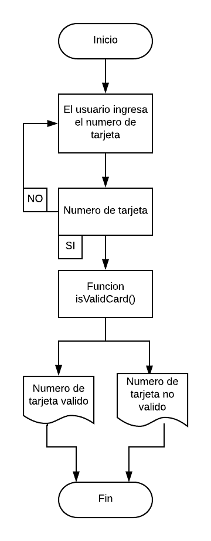

# Tarjeta de Credito
### Descripión:

Crea una web que pida, por medio de un prompt(), el número de una tarjeta de crédito y confirme su validez según el algoritmo de Luhn.

Consideraciones Específicas:

Tu código debe estar compuesto por una función: isValidCard.
El usuario no debe poder ingresar un campo vacío.

## Pseudocódigo:
### Descripción
El Pseudocodigo me sirve para detallar a grandes razgos los pasos fundamentales de tu codigo a ejecutar.

1.- Pedir el numero de la tajeta de credito.

2.- Pasar los numeros a un array en orden inverso.

3.- Aplicar las operaciones mediante la funcion isValidcard.

4.- Verificar si el numero de tarjeta es valido o no.

4.- Retornar el resultado.

## Diagrama de flujo

La secuencia grafica de nuestro Pseudocodigo

